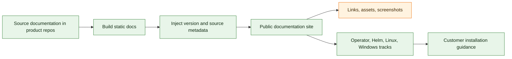

# Documentation Site E2E Test Matrix

This matrix describes E2E coverage owned by the documentation publication repository. It validates that public documentation is built, versioned, linked, and published correctly for each installation track.

Local preparation checks executed:

- `python3 scripts/build_site.py --sources-root . --output _site --public-base-path /ocp-developers-s3_storage_li9_docsrepo`
- `python3 scripts/validate_site.py --site-root _site`

## Coverage Map

## Current E2E Entrypoints

| Entrypoint | Purpose | Current status |
| --- | --- | --- |
| `.github/workflows/publish.yml` | Builds and publishes the public documentation site. | Covered. |
| `scripts/build_site.py` | Aggregates source docs into a single static site. | Covered by publish workflow. |
| `scripts/publish_site.py` | Publishes generated site output. | Covered by publish workflow. |

## Covered Documentation Features

| Feature area | Current coverage | Gap |
| --- | --- | --- |
| Multi-repo source aggregation | Pulls docs from product repositories and writes source revisions plus release metadata to `assets/docs-public-build.json`. | Public URL smoke from a clean client is still required after deployment. |
| Static site build | Builds `_site`, injects `assets/build.json`, and runs `scripts/validate_site.py`. | Public URL smoke from a clean client is still required after deployment. |
| Public publication | Publishes to Pages-like public target. | Needs public URL smoke from a clean client. |
| Platform tracks | Operator, Helm, Linux, Windows documentation exists. | Needs per-track completeness assertions. |
| Version display | `scripts/build_site.py` injects `operatorVersion`, `runtimeVersion`, `helmChartVersion`, `linuxInstallerVersion`, `windowsInstallerVersion`, `buildTag`, and `sourceRevision` into `assets/build.json`; the shared site JavaScript displays the operator/docs version badge. | Needs browser smoke after Pages deployment. |

## Prepared Missing Documentation Test Cases

| Planned case | Scope | Expected evidence |
| --- | --- | --- |
| `docs-link-check` | Crawl every generated page. | Covered by `scripts/validate_site.py`: no broken internal HTML, CSS, JS, or image links. |
| `docs-no-environment-leaks` | Scan generated HTML and text assets. | Covered by `scripts/validate_site.py`: no test cluster URLs, private tokens, or private registry credentials. |
| `docs-platform-track-completeness` | Operator, Helm, Linux, Windows tracks. | Each track has prerequisites, install, upgrade, uninstall, troubleshooting, reference links. |
| `docs-version-injection` | Compare generated version to source release metadata. | Covered locally by `scripts/build_site.py`: `_site/assets/build.json` currently renders `operatorVersion=1.1.0-alpha.41`, `runtimeVersion=1.1.0-alpha.15`, Helm/Linux/Windows `1.1.0-alpha.15`, and source revision metadata. |
| `docs-reference-page-coverage` | Every capability table link. | Each capability has a dedicated reference page with configure/use/verify steps. |
| `docs-screenshot-sanity` | OpenShift and Windows UI screenshots. | Screenshots have no environment URL and match current UI flows. |
