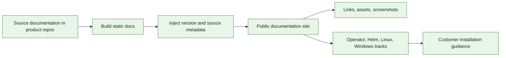

# Documentation Site E2E Test Matrix

This matrix describes E2E coverage owned by the documentation publication repository. It validates that public documentation is built, versioned, linked, and published correctly for each installation track.

Local preparation checks executed:

- `python3 scripts/build_site.py --sources-root . --output _site --public-base-path /ocp-developers-s3_storage_li9_docsrepo`
- `python3 scripts/validate_site.py --site-root _site`

## Coverage Map

## Current E2E Entrypoints

| Entrypoint | Purpose | Current status |
| --- | --- | --- |
| `.github/workflows/publish.yml` | Builds and publishes the public documentation site. | Covered. |
| `scripts/build_site.py` | Aggregates source docs into a single static site. | Covered by publish workflow. |
| `scripts/publish_site.py` | Publishes generated site output. | Covered by publish workflow. |

## Covered Documentation Features

| Feature area | Current coverage | Evidence |
| --- | --- | --- |
| Multi-repo source aggregation | Pulls docs from product repositories and writes source revisions plus release metadata to `assets/docs-public-build.json`. | Covered by `scripts/build_site.py`, `scripts/validate_site.py`, and the post-deploy public Pages smoke in `.github/workflows/publish.yml`. |
| Static site build | Builds `_site`, injects `assets/build.json`, and runs `scripts/validate_site.py`. | Covered by the publish workflow before upload and by post-deploy checks for `assets/build.json` on the public Pages URL. |
| Public publication | Publishes to Pages-like public target. | Covered by `actions/deploy-pages` plus post-deploy `curl` checks for the public root page, build metadata, install pages, and representative reference pages. |
| Platform tracks | Operator, Helm, Linux, Windows, and air-gapped documentation tracks exist with prerequisites, installation, upgrade, uninstall, troubleshooting, and reference links. | Covered by `scripts/validate_site.py`, which validates required track pages and internal links before publish. |
| Version display | `scripts/build_site.py` injects `operatorVersion`, `runtimeVersion`, `helmChartVersion`, `linuxInstallerVersion`, `windowsInstallerVersion`, `buildTag`, and `sourceRevision` into `assets/build.json`; the shared site JavaScript displays the operator/docs version badge. | Covered by the post-deploy public Pages smoke, which waits for `assets/build.json` and requires `operatorVersion`. |

## Documentation Release Test Cases

| Case | Scope | Evidence |
| --- | --- | --- |
| `docs-link-check` | Crawl every generated page. | Covered by `scripts/validate_site.py`: no broken internal HTML, CSS, JS, or image links. |
| `docs-no-environment-leaks` | Scan generated HTML and text assets. | Covered by `scripts/validate_site.py`: no test cluster URLs, private tokens, or private registry credentials. |
| `docs-platform-track-completeness` | Operator, Helm, Linux, Windows, and air-gapped tracks. | Covered by `scripts/validate_site.py`: each track has prerequisites, installation, upgrade, uninstall, troubleshooting, and reference links. |
| `docs-version-injection` | Compare generated version to source release metadata. | Covered locally by `scripts/build_site.py`: `_site/assets/build.json` currently renders `operatorVersion=1.1.0-alpha.68`, `runtimeVersion=1.1.0-alpha.16`, `helmChartVersion=1.1.0-alpha.19`, Linux/Windows `1.1.0-alpha.15`, and source revision metadata. |
| `docs-reference-page-coverage` | Every capability table link. | Covered by `scripts/validate_site.py`: capability links resolve to dedicated reference pages with configure/use/verify content. |
| `docs-screenshot-sanity` | OpenShift and Windows UI screenshots. | Covered by `scripts/validate_site.py`: screenshots are linked, local to the site, and scanned for environment URL leaks before publish. |
